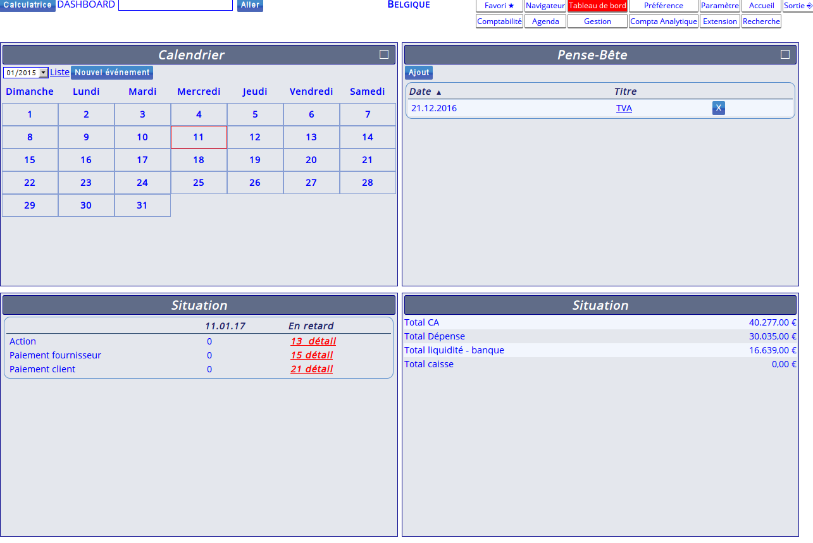

<!--
Ohart ongi: README hau automatikoki sortu da <https://github.com/YunoHost/apps/tree/master/tools/readme_generator>ri esker
EZ editatu eskuz.
-->

# Noalyss YunoHost-erako

[](https://ci-apps.yunohost.org/ci/apps/noalyss/)  

[](https://install-app.yunohost.org/?app=noalyss)

*[Irakurri README hau beste hizkuntzatan.](./ALL_README.md)*

> *Pakete honek Noalyss YunoHost zerbitzari batean azkar eta zailtasunik gabe instalatzea ahalbidetzen dizu.*  
> *YunoHost ez baduzu, kontsultatu [gida](https://yunohost.org/install) nola instalatu ikasteko.*

## Aurreikuspena

Noalyss is an accounting server intended to be hosted on the Internet in order to contain the accounting of an unlimited number of companies and users who do not know each other. Each company has its own accounting files, its own users, and cannot interfere with the accounting of others, unless expressly authorized to do so.

**Paketatutako bertsioa:** 9.2.0.5~ynh2

**Demoa:** <http://demo.noalyss.eu/index.php>

## Pantaila-argazkiak



## Dokumentazioa eta baliabideak

- Aplikazioaren webgune ofiziala: <http://noalyss.eu>
- Administratzaileen dokumentazio ofiziala: <https://wiki.noalyss.eu/doku.php>
- YunoHost Denda: <https://apps.yunohost.org/app/noalyss>
- Eman errore baten berri: <https://github.com/YunoHost-Apps/noalyss_ynh/issues>

## Garatzaileentzako informazioa

Bidali `pull request`a [`testing` abarrera](https://github.com/YunoHost-Apps/noalyss_ynh/tree/testing).

`testing` abarra probatzeko, ondorengoa egin:

```bash
sudo yunohost app install https://github.com/YunoHost-Apps/noalyss_ynh/tree/testing --debug
edo
sudo yunohost app upgrade noalyss -u https://github.com/YunoHost-Apps/noalyss_ynh/tree/testing --debug
```

**Informazio gehiago aplikazioaren paketatzeari buruz:** <https://yunohost.org/packaging_apps>
