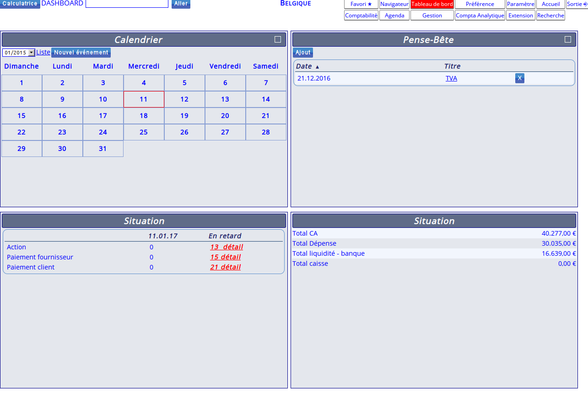

<!--
N.B.: Questo README è stato automaticamente generato da <https://github.com/YunoHost/apps/tree/master/tools/readme_generator>
NON DEVE essere modificato manualmente.
-->

# Noalyss per YunoHost

[](https://dash.yunohost.org/appci/app/noalyss)  

[](https://install-app.yunohost.org/?app=noalyss)

*[Leggi questo README in altre lingue.](./ALL_README.md)*

> *Questo pacchetto ti permette di installare Noalyss su un server YunoHost in modo semplice e veloce.*  
> *Se non hai YunoHost, consulta [la guida](https://yunohost.org/install) per imparare a installarlo.*

## Panoramica

Noalyss is an accounting server intended to be hosted on the Internet in order to contain the accounting of an unlimited number of companies and users who do not know each other. Each company has its own accounting files, its own users, and cannot interfere with the accounting of others, unless expressly authorized to do so.

**Versione pubblicata:** 9.1.0.7~ynh2

**Prova:** <http://demo.noalyss.eu/index.php>

## Screenshot



## Documentazione e risorse

- Sito web ufficiale dell’app: <http://noalyss.eu>
- Documentazione ufficiale per gli amministratori: <https://wiki.noalyss.eu/doku.php>
- Store di YunoHost: <https://apps.yunohost.org/app/noalyss>
- Segnala un problema: <https://github.com/YunoHost-Apps/noalyss_ynh/issues>

## Informazioni per sviluppatori

Si prega di inviare la tua pull request alla [branch di `testing`](https://github.com/YunoHost-Apps/noalyss_ynh/tree/testing).

Per provare la branch di `testing`, si prega di procedere in questo modo:

```bash
sudo yunohost app install https://github.com/YunoHost-Apps/noalyss_ynh/tree/testing --debug
o
sudo yunohost app upgrade noalyss -u https://github.com/YunoHost-Apps/noalyss_ynh/tree/testing --debug
```

**Maggiori informazioni riguardo il pacchetto di quest’app:** <https://yunohost.org/packaging_apps>
